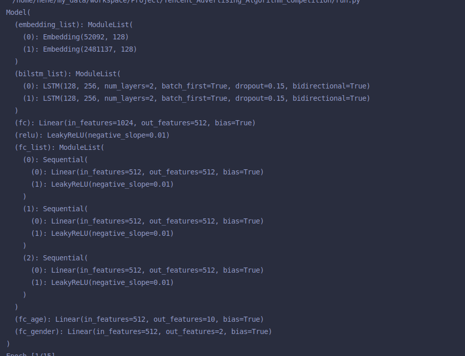

# 腾讯广告大赛
## 1. 数据
## 2. 运行方式
### 2.1 准备数据
1. path_project准备好,依次运行tools的文件
### 2.2 模型运行
1. 运行run

## 线下分数（140.17）
1. 使用特征：creative_id, advertiser_id
2. 训练词向量：所有数据，没有去除任何数据，window_size = 10,  sg=1, hs=0.
3. rnn区max(dim=1).values
4. 初步判断Ad与creative_id及其相似，并且ad会好一点。
5. 模型如图：
